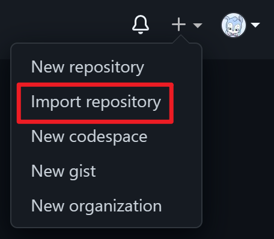
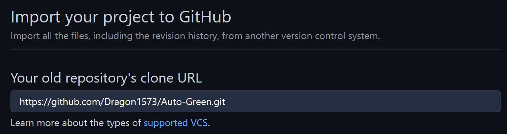
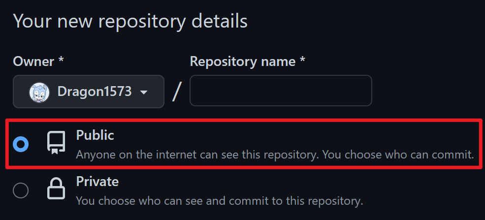
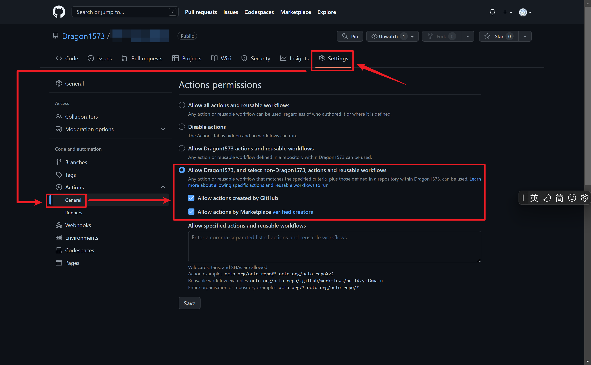
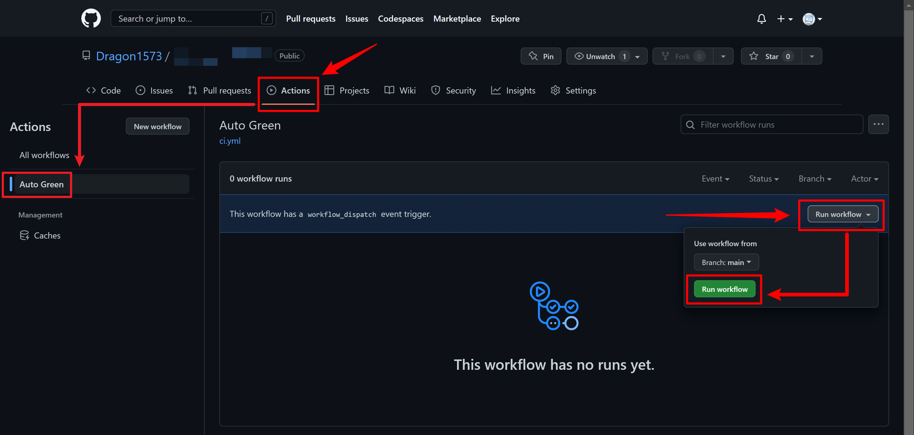

<center>
  <h1>Auto Green</h1>
  <a href="https://github.com/Dragon1573/Auto-Green/actions/workflows/actions.yml">
  	
  </a>
  &nbsp;
  <a href="">
    
  </a>
</center>

自动保持 GitHub 提交状态常绿。

## 原理

使用 GitHub Actions 的定时任务功能，每隔一段时间自动执行 `git commit` 。

> 有关 Github Action 的原理，可查看官方文档 [Github Action 简介](https://docs.github.com/cn/actions/learn-github-actions/introduction-to-github-actions) 。

## 使用

### Step 1 - 创建远程仓库

- :warning: **不要直接 Fork 本项目！** 所有在 Fork 上的贡献不会被 GitHub 统计。
- :warning: **不推荐将此仓库设置为私有！** GitHub 默认不统计用户在私有仓库中的贡献，但你可以在 User Profile 页面上勾选以添加此类统计。

>  具体原因详见 [为什么我的贡献没有在我的个人资料中显示？](https://docs.github.com/zh/account-and-profile/setting-up-and-managing-your-github-profile/managing-contribution-settings-on-your-profile/why-are-my-contributions-not-showing-up-on-my-profile)

1. 点击页面右上角的 `+` ，选择 `Import Repository`
   
   
2. 输入本仓库链接 `https://github.com/Dragon1573/Auto-Green.git`
   
3. 选择仓库详情设置为 `Public`
   
4. 等待项目完成导入

### Step 2 - 启用 GitHub Actions 功能

成功导入后的 GitHub 仓库默认不启用 GitHub Actions 功能，需要手动启用。

1. 在导入成功的仓库首页，前往 `Settings > Code and automation > Actions > General`
2. 在 `Actions permissions` 控制区内选择第4项 `Allow user, and select non-user, actions and reusable workflows`
3. 勾选 `Allow actions created by GitHub` 和 `Allow actions by Marketplace verified creators`
4. 点击 `Save` 保存
   

### Step 3 - 设置定时任务

本项目[配置文件](./.github/workflows/actions.yml)已启用定时任务，触发时间为 **世界协调时（UTC）每天 00:00** 。

```yaml
on:
  # 世界协调时每天凌晨 00:00 自动执行
  # 即北京时间每天上午 08:00
  schedule:
    - cron: 0 0 * * *
```

- GitHub Actions 的定时任务使用 `on.schedule` 事件进行设置，遵循 [**POSIX cron 语法**](https://pubs.opengroup.org/onlinepubs/9699919799/utilities/crontab.html#tag_20_25_07)
- 定时任务将选取**默认分支**（本项目是 `main` ）下的最新提交作为运行时环境
- GitHub 限制最小定时周期为 **每5分钟触发一次**
- GitHub 触发时间统一使用 **世界协调时（UTC）** ，请注意与 **北京时间（UTC +8）** 的时差

> 如果需要自行修改触发时间，请参考官方中文文档： [触发工作流的事件（`schedule`）](https://docs.github.com/zh/actions/using-workflows/events-that-trigger-workflows#schedule)

### Step 4 - 配置 Git 身份

`actions/checkout` 完成远程仓库的过程有一点「黑魔法」的意思，它并没有帮助我们配置 Git 身份信息，身份信息的缺失会导致配置文件中的 `git commit` 和 `git push` 操作出问题。

你需要修改[配置文件](./.github/workflows/actions.yml)的第37～38行，将用户名和电子邮箱地址设置为与你账户关联的信息。

```yaml
jobs:
  autogreen:
    steps:
      - name: Configure Git identity
        run: |
          git config --global user.name "Your name"
          git config --global user.email "you@mail.example.com"
```

### Step 5 - （可选）手动触发任务

本项目配置文件预留了 `on.workflow_dispatch` 手动触发渠道，用户可以随时手动触发任务执行以检查配置文件能否正常工作。

1. 在仓库页面的选项卡上选择 `Actions > Auto Green > Run workflow`
2. 在弹出的悬浮面板中选择 `Branch: main` ，并点击 `Run workflow`
3. 等待任务执行完毕（大约 30sec ）


